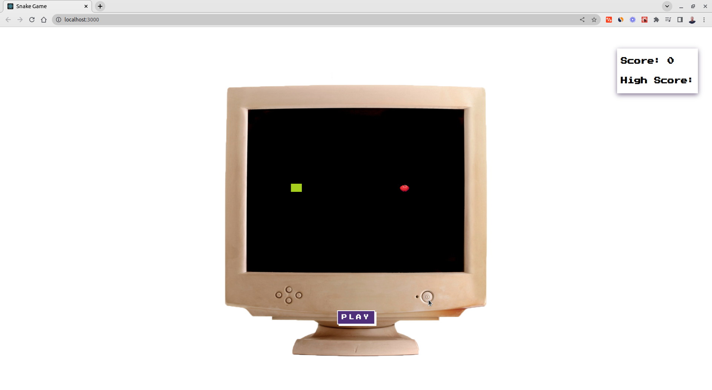
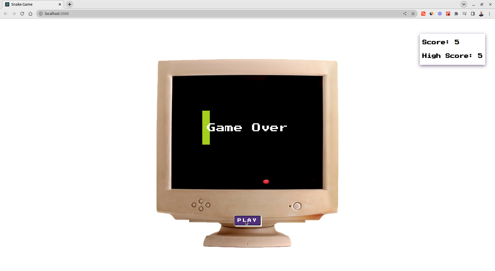

# Snake Game

[](https://snake-game-ts.netlify.app/)

[](https://snake-game-ts.netlify.app/)

A Snake Game in React and TypeScript

## Technologies

- React
- TypeScript

## Setup

```code
# Clone this repo
git clone https://github.com/hesbon-osoro/snake-game.git

# Navigate to directory and install packages
cd snake-game && yarn

# Start the App
yarn start

```
